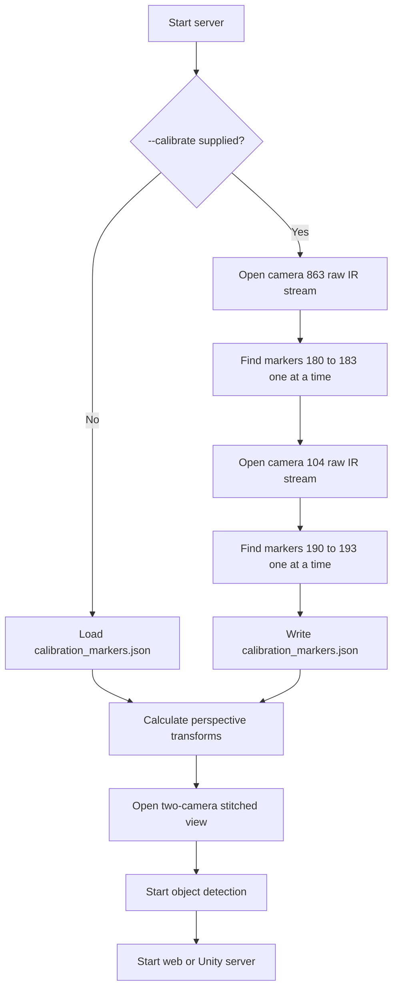

# Fixed-rig camera calibration

The tracking server normally reuses the existing camera calibration. Calibration
is an explicit administrator action and does not run on every server startup.

## Normal startup

```powershell
.\run-server.ps1
```

Normal startup:

1. Loads `calibration_markers.json` without modifying it.
2. Calculates the camera perspective transforms.
3. Opens the two-camera stitched view.
4. Starts marker detection and the selected network server.

If `calibration_markers.json` is missing or invalid, normal startup fails. Run
the administrator calibration command to create a fresh file.

## Administrator calibration

```powershell
.\run-server.ps1 -Calibrate
```

The equivalent direct command is:

```powershell
uv run --python 3.13 --with-requirements requirements.txt -- python server.py --calibrate
```

Unity mode can be selected independently:

```powershell
.\run-server.ps1 -Client unity -Calibrate
```

Calibration mode:

1. Opens camera `863` and processes its raw IR frames.
2. Searches for its fixed corner markers one at a time.
3. Saves the first successful pixel-center detection for each target.
4. Repeats the same process for camera `104`.
5. Replaces `calibration_markers.json` only after every marker is found.
6. Regenerates `calibration_visualizations` from the same fresh measurements.
7. Calculates transforms from the fresh calibration.
8. Starts the normal stitched tracking server.

The preview shows the current target and every marker ID detected in the current
frame. Terminal output confirms each successful target with a `READ marker ...`
message. If a target times out, the error lists all IDs observed while waiting.

## Fixed physical rig

Each table element is 80 cm × 80 cm. Calibration marker centers are 3 cm from
their nearest table edges. Camera IDs intentionally use the final three serial
number digits exposed by the existing camera subsystem.

| Camera | Table position | Top-left | Top-right | Bottom-right | Bottom-left |
| --- | --- | ---: | ---: | ---: | ---: |
| `863` | X1 / `top_left` | 180 | 181 | 182 | 183 |
| `104` | X2 / `top_right` | 190 | 191 | 192 | 193 |

Corner order is clockwise in image coordinates: top-left, top-right,
bottom-right, bottom-left. The source of truth is `rig_config.py`.

## Runtime flow



## Operational notes

- Calibration markers near image corners may be difficult to detect because of
  perspective distortion, infrared reflections, or insufficient white border.
- Additional light may improve detection on the physical installation.
- Calibration advances after one successful detection, matching the proven
  manual workflow.
- Press `Q` in a calibration preview to cancel without replacing the existing
  calibration file.
- Normal startup does not rewrite calibration visualizations. They are generated
  together with `calibration_markers.json` during a successful admin calibration.
