# CityScope object tracking

## How to run
- Install requirements
- Run server.py 
- Connect to the opened websocket to read results. (By running the COUP-TangibleTable unity project)
- A visual debug monitor will show you what the camera sees and which markers are recognized.

Depending on your light conditions you might need to choose different settings for exposure and gain in the `realsense/realsense_device_manager.py`.

---

## Calibration and Distortion Analysis
After calibration markers are detected, a distortion analysis is run to verify that:
- markers are equidistant from the image center
- sides and diagonals form a square
- angles are ~90°

Artifacts are exported to `calibration_visualizations/`:
- `camera_XXX_markers.png`: Detected calibration marker positions per camera
- `combined_calibration.png`: Side-by-side view of all cameras
- `camera_XXX_distortion_analysis.png`: Per-camera distortion report (generated after running analysis)
- `distortion_summary.png`: Overview comparison across cameras (generated after running analysis)

### Examples (exported)
Detected calibration markers:


Combined calibration view:


Distortion reports (appear after you run calibration or `distortion_analysis.py`):


To run the analysis standalone:
```
python distortion_analysis.py
```

---

## Stitching Process (overview)
The stitching pipeline processes each camera stream with enhancement and perspective transforms and then joins them into a unified view.

### Step-by-step (sample exports)
Raw IR frames:

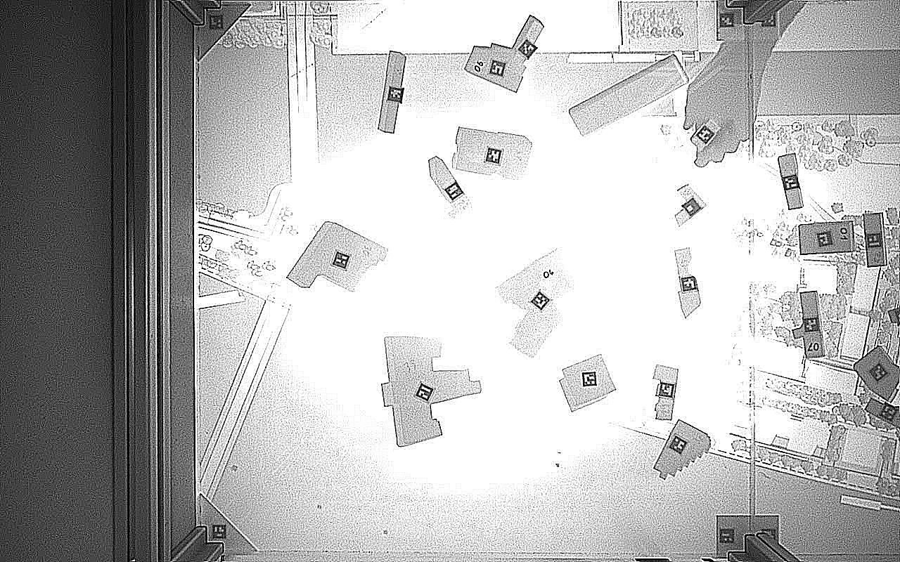
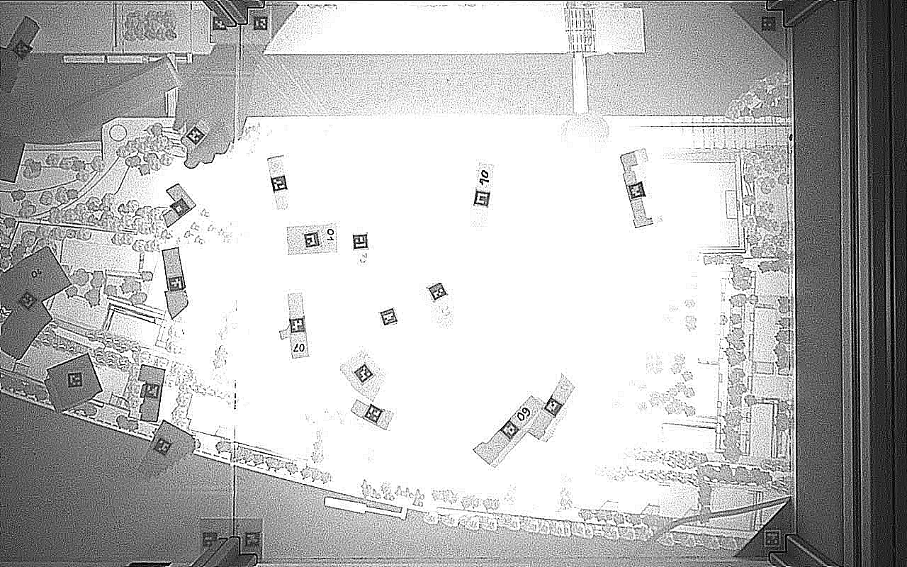

Enhanced (sharpened/rotated):

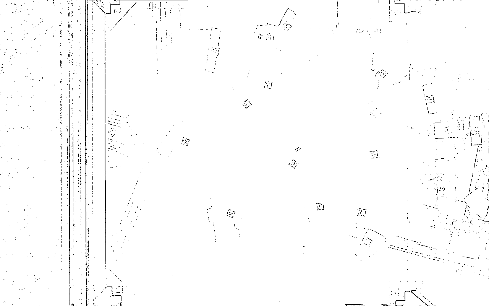
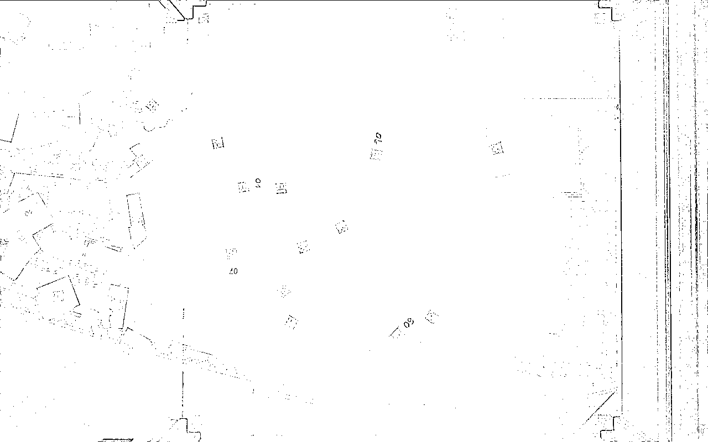

Perspective transform results:

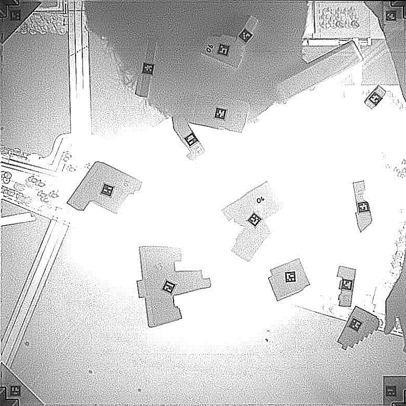
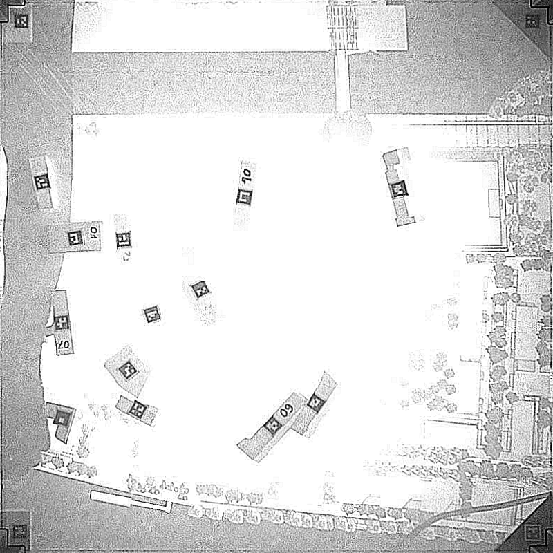

Warped views:

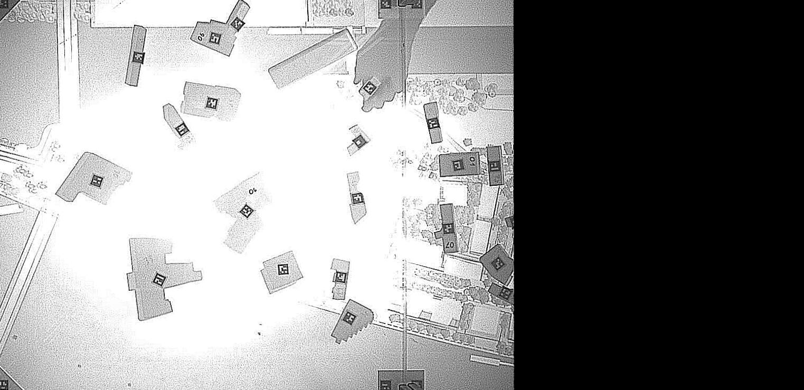
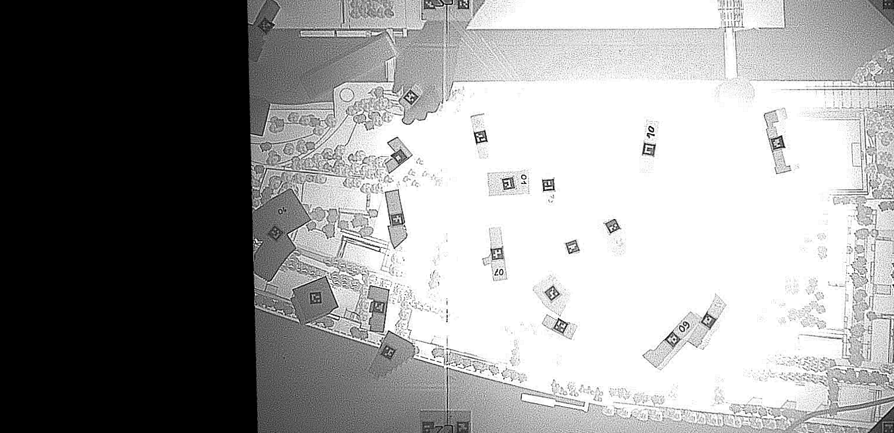

Stitching steps and results:

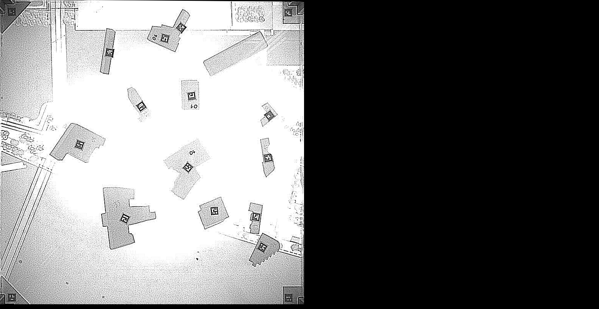
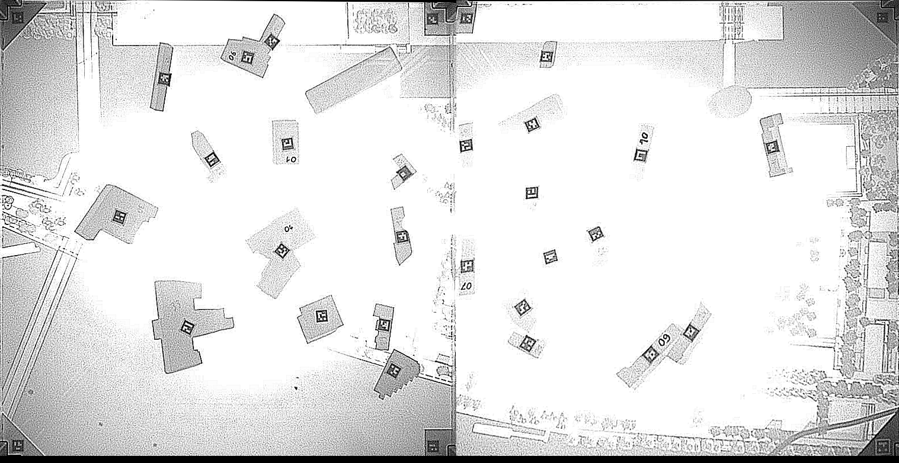

Final stitched outputs (examples):

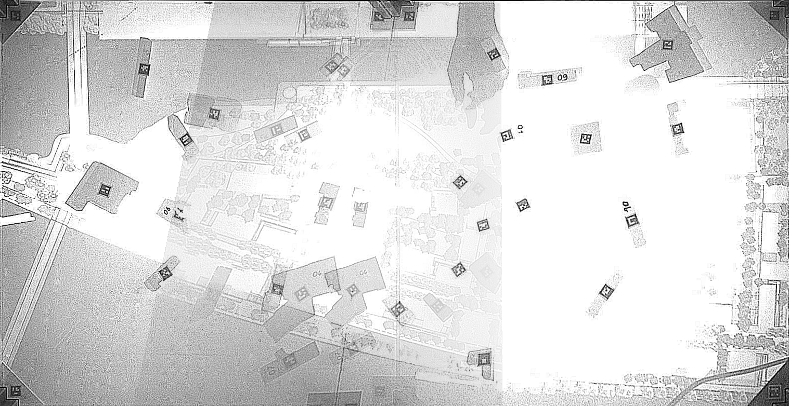
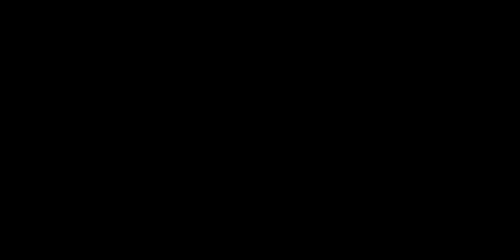
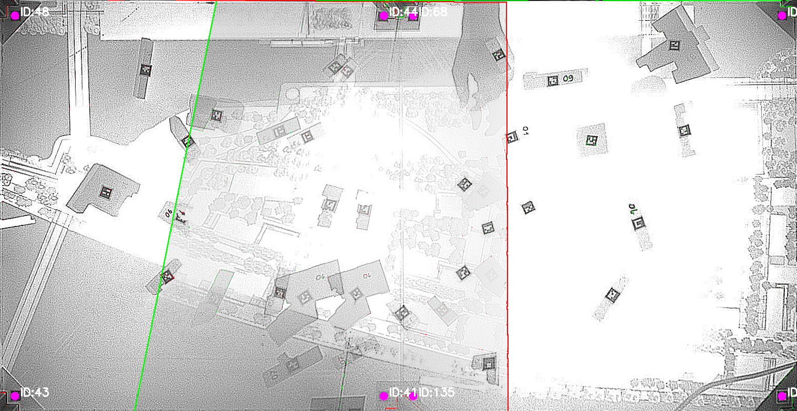

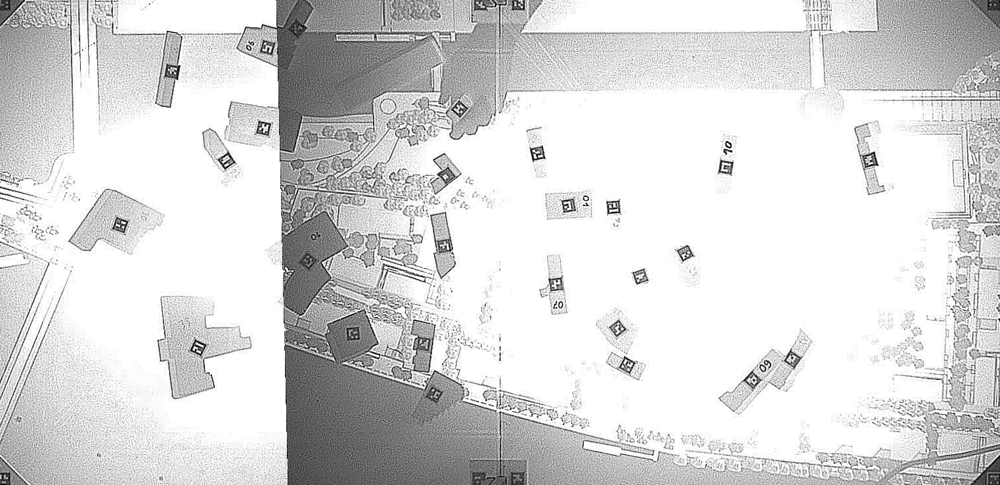
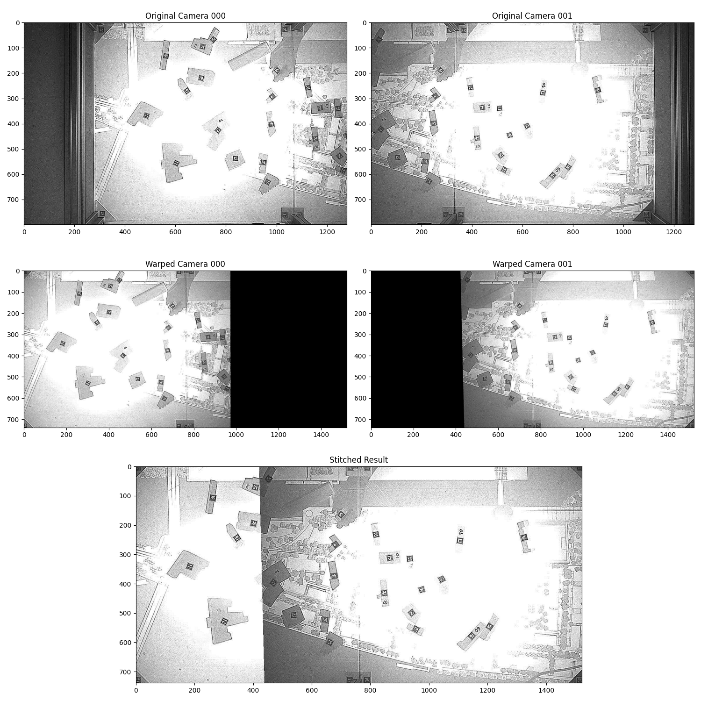

---

### Sources
- https://github.com/IntelRealSense/librealsense/tree/master/wrappers/python
- [realsense API](https://intelrealsense.github.io/librealsense/python_docs/_generated/pyrealsense2.html#module-pyrealsense2)
- [aruco opencv](https://docs.opencv.org/4.x/d9/d6a/group__aruco.html#gab9159aa69250d8d3642593e508cb6baa)
