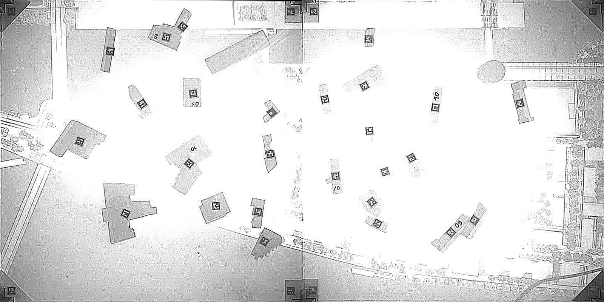

# CityScope object tracking

## Executive summary

This repo powers real‑time table object tracking using IR cameras (Intel RealSense). It detects ArUco markers, calibrates multi‑camera views to a common table coordinate system, stitches cameras into a unified top‑down view, analyzes camera distortion/positioning quality, and streams tracking data to a client (e.g., Unity).

### What it does
- Marker detection: Finds ArUco markers per frame and maps them to table/object identities.
- Calibration: Uses 4 corner markers per camera to compute perspective transforms to a table‑aligned view.
- Stitching: Warps each camera to table coordinates and joins them into a single image (1×2 or 2×2 layout).
- Distortion analysis: Quantifies how "square" and centered the calibration is; exports annotated reports to guide camera positioning.
- Streaming: Runs a TCP server on localhost:8052, pushing fused marker updates for external clients (Unity).

### Key components
- `server.py`: Entry point; runs calibration, sets up stitching, processes streams, serves tracking data.
- `find_calibration_markers.py`: Detects 4 calibration markers per camera; exports per‑camera visuals.
- `camera_stitching.py`: Computes perspective transforms, normalizes scale, and stitches camera views.
- `distortion_analysis.py`: Rates calibration quality and exports per‑camera and summary reports.
- `detection.py`, `hud.py`, `tracker.py`: Marker detection, on‑screen HUD, and tracking utilities.

### Outputs you get
Exported to `calibration_visualizations/`:
- Per‑camera calibration visuals: `calibration_visualizations/camera_XXX_markers.png`
- Combined calibration view: `calibration_visualizations/combined_calibration.png`
- Distortion reports: `calibration_visualizations/camera_XXX_distortion_analysis.png`, `calibration_visualizations/distortion_summary.png`
- Stitched result sample: `calibration_visualizations/stitched_sample.png`

## How to use it

### 1) Install dependencies
```
pip install -r requirements.txt
```

### 2) Run the server
```
python server.py
```
- Performs/loads calibration, initializes stitching, and starts streaming on `localhost:8052`.
- A debug monitor shows stitched output and detected markers.

### 3) Connect your client
- Unity (COUP‑TangibleTable) or any TCP client can consume updates from `localhost:8052`.
- Use `client.py` for basic testing of the TCP connection.

### 4) Inspect calibration and quality
- Check `calibration_visualizations/` for:
  - `camera_XXX_markers.png`, `combined_calibration.png`
  - Distortion analysis: `camera_XXX_distortion_analysis.png`, `distortion_summary.png`

### Optional utilities
- Run distortion analysis standalone (on `calibration_markers.json`):
```
python distortion_analysis.py
```
- Test distortion analysis with sample data:
```
python test_distortion_analysis.py
```
- Explore stitching/processing logic in `camera_stitching.py`; calibration flow in `find_calibration_markers.py`.

### Tips
- Keep the camera centered over the table; aim for "Good" (≥0.90) or "Excellent" (≥0.95) distortion scores.
- If the table/camera moves, re‑run calibration to refresh transforms and quality reports.

## How to run
- Install requirements
- Run server.py 
- Connect to the opened websocket to read results. (By running the COUP-TangibleTable unity project)
- A visual debug monitor will show you what the camera sees and which markers are recognized.

Depending on your light conditions you might need to choose different settings for exposure and gain in the `realsense/realsense_device_manager.py`.

---

## Calibration and Distortion Analysis
After calibration markers are detected, a distortion analysis is run to verify that:
- markers are equidistant from the image center
- sides and diagonals form a square
- angles are ~90°

Artifacts are exported to `calibration_visualizations/`:
- `camera_XXX_markers.png`: Detected calibration marker positions per camera
- `combined_calibration.png`: Side-by-side view of all cameras
- `camera_XXX_distortion_analysis.png`: Per-camera distortion report (generated after running analysis)
- `distortion_summary.png`: Overview comparison across cameras (generated after running analysis)
- `stitched_sample.png`: Sample of stitched camera output (generated when server runs)

### Examples (exported)
Detected calibration markers:


Combined calibration view:



Distortion reports (appear after you run calibration or `distortion_analysis.py`):


To run the analysis standalone:
```
python distortion_analysis.py
```

---

## Stitching Process
The stitching pipeline processes each camera stream with enhancement (sharpening/rotation) and perspective transforms, then joins them into a unified view.

The system automatically:
1. Loads calibration from `calibration_markers.json`
2. Applies perspective transforms to align each camera to table coordinates
3. Normalizes scales and stitches cameras into a single top-down view
4. Runs real-time marker detection on the stitched result

### Detailed Stitching Pipeline

The multi-camera stitching system (`camera_stitching.py`) transforms individual camera feeds into a unified top-down table view through **two distinct phases**:

## 🔧 **PHASE 1: ONE-TIME SETUP** (at application startup)
## ⚡ **PHASE 2: REAL-TIME PROCESSING** (applied to every frame)

---

### 🔧 **PHASE 1: ONE-TIME SETUP** (Happens ONCE at startup)

#### **1. Load Calibration Data** 
- **Reads `calibration_markers.json`**: Contains pixel positions of 4 ArUco markers per camera (detected during initial calibration)
- **No live camera processing**: Uses pre-recorded marker positions from calibration file

#### **2. Calculate Perspective Transforms** (`calculate_perspective_transform()`)
- **Computes transformation matrices**: Calls `cv2.getPerspectiveTransform(src_points, dst_points)` at **line 59**
- **One matrix per camera**: Each camera gets its own 3×3 transformation matrix
- **Stored for reuse**: These matrices are calculated ONCE and saved in memory

#### **3. Pre-calculate Output Dimensions**
- **Maps physical to pixels**: 15 pixels/cm scale factor applied to table measurements
- **Determines unified scale**: All cameras normalized to same pixel dimensions
- **Layout analysis**: Detects camera positions (top-left, top-right, etc.) from marker coordinates

**🎯 Result**: Setup returns a configuration object with pre-calculated transforms, dimensions, and layout - **NO MORE CALCULATIONS NEEDED**

<details>
<summary><strong>🔍 Click to see HOW the transformation matrices are calculated</strong></summary>

**How the Transformation Matrix is Created:**

The transformation matrix is calculated using OpenCV's `cv2.getPerspectiveTransform()` which maps 4 source points to 4 destination points.

1. **Source Points** (from camera view): The actual pixel positions where ArUco markers were detected
2. **Destination Points** (target rectangle): Perfect rectangle coordinates where we want those markers to appear

**Example with Real Data from Camera 000:**
```python
# Source points (distorted quadrilateral from camera):
src_points = [
    [307.07, 31.44],    # top_left marker in camera image
    [1033.14, 27.77],   # top_right marker in camera image  
    [1033.47, 762.29],  # bottom_right marker in camera image
    [311.40, 756.73]    # bottom_left marker in camera image
]

# Destination points (perfect rectangle):
# Physical table: 74cm × 74cm, scale factor: 15 pixels/cm = 1110×1110 image
# Markers are 3cm from edges, so 45 pixels offset
dst_points = [
    [45, 45],           # top_left: 3cm × 15px/cm from edges
    [1065, 45],         # top_right: (74-3)cm × 15px/cm from left edge
    [1065, 1065],       # bottom_right: (74-3)cm × 15px/cm from both edges  
    [45, 1065]          # bottom_left: 3cm × 15px/cm from right, (74-3)cm from top
]

# OpenCV calculates the 3×3 transformation matrix:
transform_matrix = cv2.getPerspectiveTransform(src_points, dst_points)  # ← LINE 59
```

**What the Matrix Does:**
- **Corrects perspective distortion**: The camera sees a trapezoid/quadrilateral, matrix transforms it to a perfect rectangle
- **Corrects rotation**: If the camera is rotated relative to the table, the matrix straightens it
- **Corrects scale**: Maps the physical 74×74cm table area to exactly 1110×1110 pixels (15 pixels/cm)
- **Corrects position**: Centers the table area in the output image with proper 3cm borders

</details>

**Code reference**: `setup_camera_transforms()` calls `calculate_perspective_transform()` in `camera_stitching.py:12-60`

---

### ⚡ **PHASE 2: REAL-TIME PROCESSING** (Applied to EVERY frame at ~30 FPS)

Now the pre-calculated transforms are applied to live camera streams:

#### **1. Frame Preprocessing** (`process_and_join_streams()`)
Each incoming camera frame undergoes enhancement:
- **Image sharpening**: Applies a 3×3 convolution kernel `[[-1,-1,-1],[-1,9,-1],[-1,-1,-1]]` to enhance edge definition
- **Buffer conversion**: Transforms RealSense buffer format to OpenCV-compatible numpy arrays
- **Note**: Despite the function name `sharpen_and_rotate_image()`, it currently only performs sharpening - no rotation is applied

**Code reference**: `sharpen_and_rotate_image()` in `image.py:16-19`

#### **2. Apply Pre-calculated Perspective Transforms** 
**🚨 KEY POINT**: The transformation matrices were calculated ONCE during setup. Now we just apply them to each frame:

```python
# This happens for EVERY frame (fast matrix multiplication):
transformed = cv2.warpPerspective(processed_frame, transforms[camera_id], output_sizes[camera_id])
```

**Code reference**: `process_and_join_streams()` in `camera_stitching.py:268-275`

#### **3. Scale Normalization & Image Stitching**
- **Fast resize**: Each transformed image is resized to unified dimensions using pre-calculated values
- **Frame buffering**: Collect frames from all cameras before stitching to ensure synchronization
- **Layout-based joining**: Use pre-determined camera layout to stitch images (horizontal then vertical stacking)

**Code reference**: `process_and_join_streams()` in `camera_stitching.py:276-291`

#### **Performance Summary:**
- **Setup**: Heavy calculations done ONCE (perspective transforms, dimensions, layout)  
- **Runtime**: Only fast operations per frame (matrix multiplication, resize, image stacking)
- **Result**: ~30 FPS real-time stitching performance

---

## 📊 **Image Stitching Details** (`create_final_stitched_image()`)
The system intelligently combines camera feeds based on detected layout:

**Layout Detection**:
- **2×2 grid**: Full table coverage with cameras in all four positions
- **1×2 horizontal**: Cameras only in top row OR bottom row
- **Fallback handling**: Uses black placeholders for missing camera positions (defensive programming)

**Joining Process**:
- **Horizontal joining**: `join_images_horizontally()` combines left/right camera pairs using `np.hstack()`
- **Vertical stacking**: `join_images_vertically()` stacks top/bottom rows using `np.vstack()`
- **Size consistency**: Ensures all images have matching dimensions before joining

**Code reference**: 
- Layout logic: `create_final_stitched_image()` in `camera_stitching.py:185-225`
- Joining functions: `camera_stitching.py:135-183`

#### ⚡ **6. Real-time Performance Optimization**
- **One-time setup**: All perspective transforms calculated during initialization, not per-frame
- **Frame buffering**: Collects frames from all cameras before stitching to ensure synchronization
- **Efficient processing**: Matrix operations (warpPerspective, resize, hstack/vstack) optimized for ~30 FPS performance

#### 📊 **7. Quality Assurance**
The system includes comprehensive quality monitoring:
- **Distortion analysis**: Validates that calibration markers form proper squares with 90° angles
- **Positioning feedback**: Provides scores for camera centering, uniformity, and alignment
- **Visual exports**: Generates annotated images showing calibration quality and stitching results

**Code reference**: `distortion_analysis.py` and quality metrics in `analyze_camera_distortion()`

## 🔄 **Complete Data Flow**

### **SETUP PHASE** (Once at startup):
```
calibration_markers.json → Calculate Transform Matrices → Store in Memory
```

### **RUNTIME PHASE** (Every frame at 30 FPS):
```
Camera 000 (1280×720) → Sharpen → Apply Stored Matrix → Resize → ┐
                                                                  ├→ Stitch → Final Image
Camera 001 (1280×720) → Sharpen → Apply Stored Matrix → Resize → ┘
```

**🚨 Key Point**: The expensive `cv2.getPerspectiveTransform()` calculation happens ONLY during setup. At runtime, we just use `cv2.warpPerspective()` with the pre-calculated matrices - this is why we achieve 30 FPS performance!

The result is a seamless top-down view where each camera's coverage area is geometrically corrected and properly aligned with the physical table coordinates.

---

### Sources
- https://github.com/IntelRealSense/librealsense/tree/master/wrappers/python
- [realsense API](https://intelrealsense.github.io/librealsense/python_docs/_generated/pyrealsense2.html#module-pyrealsense2)
- [aruco opencv](https://docs.opencv.org/4.x/d9/d6a/group__aruco.html#gab9159aa69250d8d3642593e508cb6baa)
