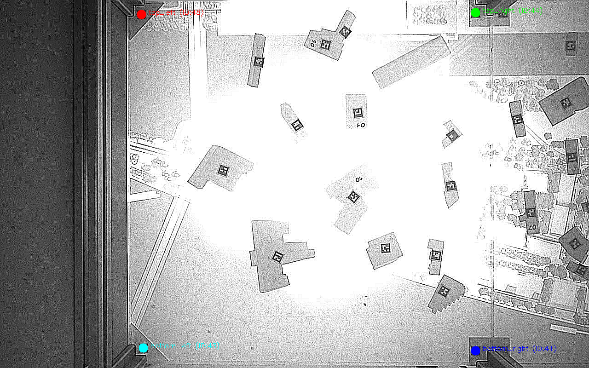
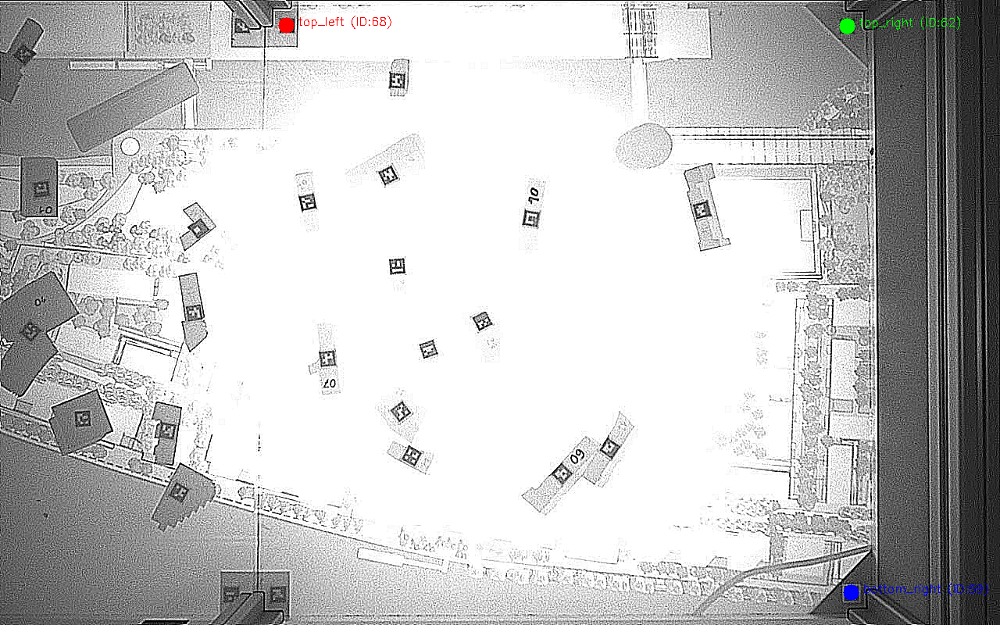
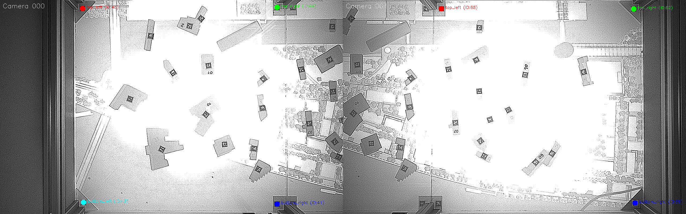
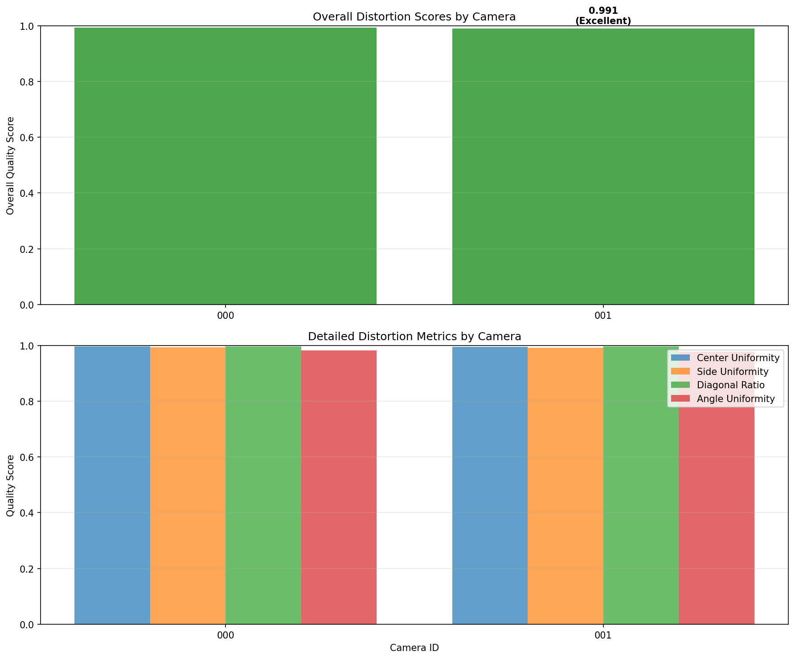
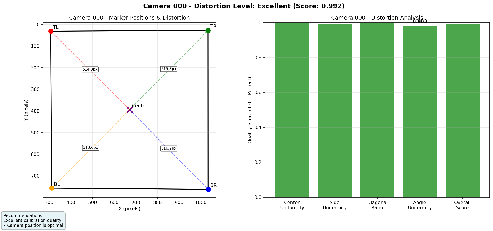
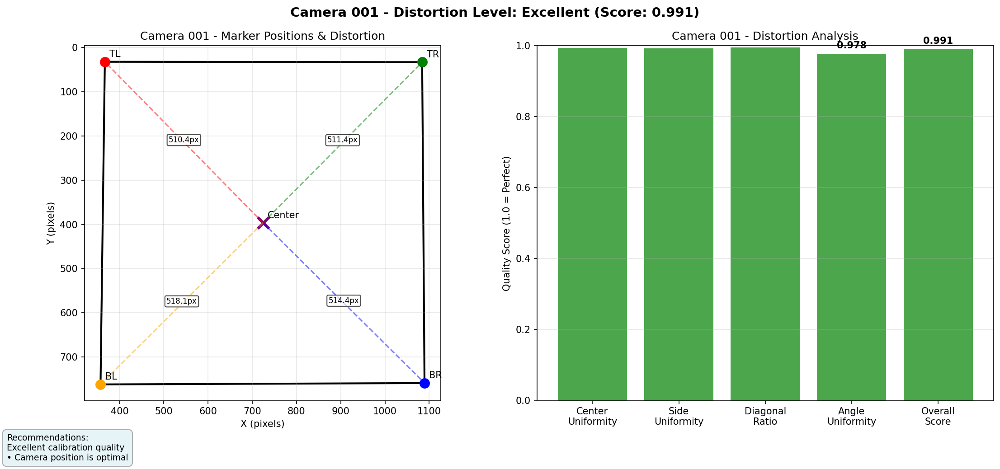

# CityScope object tracking

## Executive summary

This repo powers real‑time table object tracking using IR cameras (Intel RealSense). It detects ArUco markers, calibrates multi‑camera views to a common table coordinate system, stitches cameras into a unified top‑down view, analyzes camera distortion/positioning quality, and streams tracking data to a client (e.g., Unity).

### What it does
- Marker detection: Finds ArUco markers per frame and maps them to table/object identities.
- Calibration: Uses 4 corner markers per camera to compute perspective transforms to a table‑aligned view.
- Stitching: Warps each camera to table coordinates and joins them into a single image (1×2 or 2×2 layout).
- Distortion analysis: Quantifies how "square" and centered the calibration is; exports annotated reports to guide camera positioning.
- Streaming: Runs a TCP server on localhost:8052, pushing fused marker updates for external clients (Unity).

### Key components
- `server.py`: Entry point; runs calibration, sets up stitching, processes streams, serves tracking data.
- `find_calibration_markers.py`: Detects 4 calibration markers per camera; exports per‑camera visuals.
- `camera_stitching.py`: Computes perspective transforms, normalizes scale, and stitches camera views.
- `distortion_analysis.py`: Rates calibration quality and exports per‑camera and summary reports.
- `detection.py`, `hud.py`, `tracker.py`: Marker detection, on‑screen HUD, and tracking utilities.

### Outputs you get
Exported to `calibration_visualizations/`:
- Per‑camera calibration visuals: `calibration_visualizations/camera_XXX_markers.png`
- Combined calibration view: `calibration_visualizations/combined_calibration.png`
- Distortion reports: `calibration_visualizations/camera_XXX_distortion_analysis.png`, `calibration_visualizations/distortion_summary.png`
- Stitched result sample: `calibration_visualizations/stitched_sample.png`

## How to use it

### 1) Install dependencies
```
pip install -r requirements.txt
```

### 2) Run the server
```
python server.py
```
- Performs/loads calibration, initializes stitching, and starts streaming on `localhost:8052`.
- A debug monitor shows stitched output and detected markers.

### 3) Connect your client
- Unity (COUP‑TangibleTable) or any TCP client can consume updates from `localhost:8052`.
- Use `client.py` for basic testing of the TCP connection.

### 4) Inspect calibration and quality
- Check `calibration_visualizations/` for:
  - `camera_XXX_markers.png`, `combined_calibration.png`
  - Distortion analysis: `camera_XXX_distortion_analysis.png`, `distortion_summary.png`

### Optional utilities
- Run distortion analysis standalone (on `calibration_markers.json`):
```
python distortion_analysis.py
```
- Test distortion analysis with sample data:
```
python test_distortion_analysis.py
```
- Explore stitching/processing logic in `camera_stitching.py`; calibration flow in `find_calibration_markers.py`.

### Tips
- Keep the camera centered over the table; aim for "Good" (≥0.90) or "Excellent" (≥0.95) distortion scores.
- If the table/camera moves, re‑run calibration to refresh transforms and quality reports.

## How to run
- Install requirements
- Run server.py 
- Connect to the opened websocket to read results. (By running the COUP-TangibleTable unity project)
- A visual debug monitor will show you what the camera sees and which markers are recognized.

Depending on your light conditions you might need to choose different settings for exposure and gain in the `realsense/realsense_device_manager.py`.

---

## Calibration and Distortion Analysis
After calibration markers are detected, a distortion analysis is run to verify that:
- markers are equidistant from the image center
- sides and diagonals form a square
- angles are ~90°

Artifacts are exported to `calibration_visualizations/`:
- `camera_XXX_markers.png`: Detected calibration marker positions per camera
- `combined_calibration.png`: Side-by-side view of all cameras
- `camera_XXX_distortion_analysis.png`: Per-camera distortion report (generated after running analysis)
- `distortion_summary.png`: Overview comparison across cameras (generated after running analysis)
- `stitched_sample.png`: Sample of stitched camera output (generated when server runs)

### Examples (exported)
Detected calibration markers:




Combined calibration view:



Distortion reports (appear after you run calibration or `distortion_analysis.py`):





To run the analysis standalone:
```
python distortion_analysis.py
```

---

## Stitching Process
The stitching pipeline processes each camera stream with enhancement (sharpening/rotation) and perspective transforms, then joins them into a unified view.

The system automatically:
1. Loads calibration from `calibration_markers.json`
2. Applies perspective transforms to align each camera to table coordinates
3. Normalizes scales and stitches cameras into a single top-down view
4. Runs real-time marker detection on the stitched result

---

### Sources
- https://github.com/IntelRealSense/librealsense/tree/master/wrappers/python
- [realsense API](https://intelrealsense.github.io/librealsense/python_docs/_generated/pyrealsense2.html#module-pyrealsense2)
- [aruco opencv](https://docs.opencv.org/4.x/d9/d6a/group__aruco.html#gab9159aa69250d8d3642593e508cb6baa)
